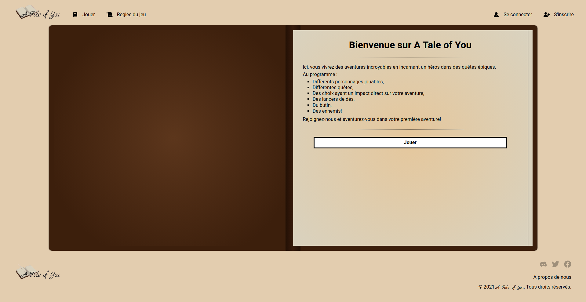

# A Tale of You 📖

Un projet de Livre Héro ! Ici, vous vivrez des aventures incroyables en incarnant un héros dans des quêtes épiques ! Au programme: Votre héros favori, des quêtes, du butin, des ennemis !

## Le projet ❓

Après avoir fait une formation fullstack de 5 mois, avec l'école [**O'clock**](https://oclock.io/?utm_campaing=nouvelle&gclid=Cj0KCQiAzMGNBhCyARIsANpUkzMjvbZe1jxwGmAhFWHNsbg5mt56-QHsWdwDFZpXxa4rPm2e0iF6CRoaAi0zEALw_wcB) labélisé Grande école du numérique, j'y ai pu apprendre **le JavaScript** (côté front, back), **React** (avec Redux) !! 👨‍💻  

Le dernier mois, pour finaliser la formation, j'ai réalisé un projet de **Livre Héro** 📖 ! Dans une équipe de 4 développeurs, je me suis occupé de la partie **développement Frontend** (méthodologie Scrum, en 4 sprints).

### Les technologies utilisés pour ce dernier

- React
- Redux
- NodeJS

> *Petit tip's : Si tu veux test l'aventure A Tale of You, teste avec le Magicien 🧙*
